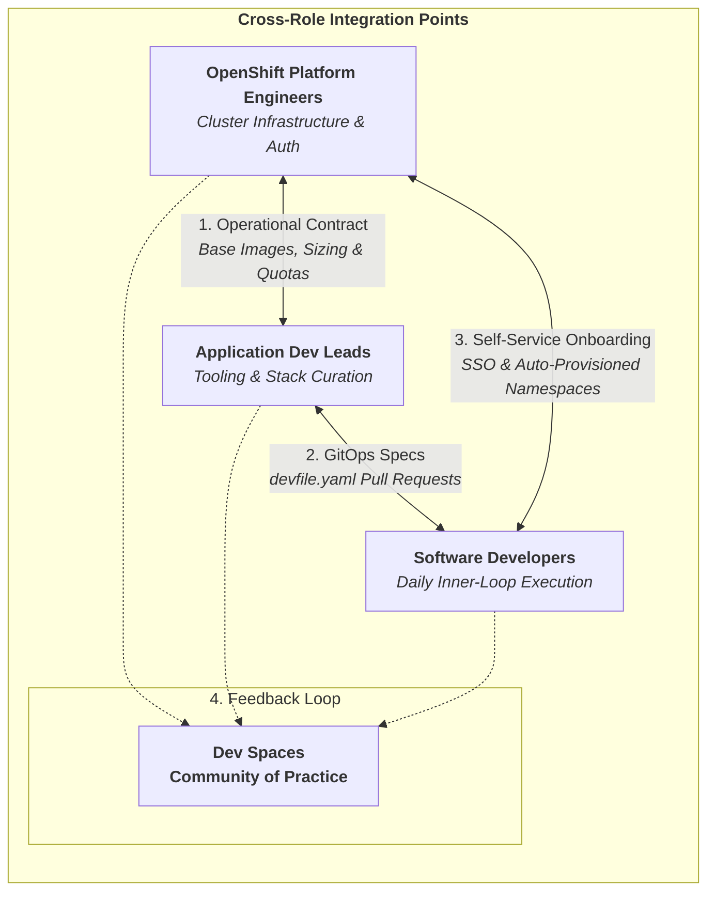
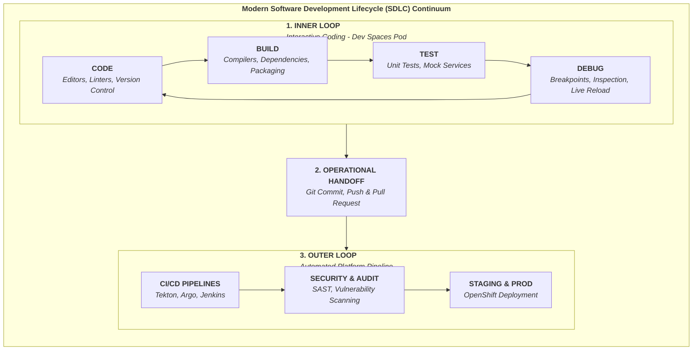
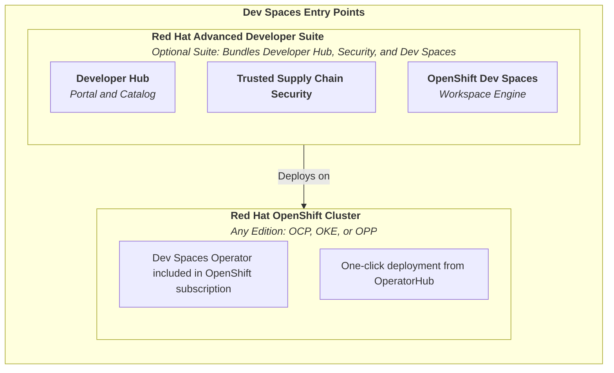
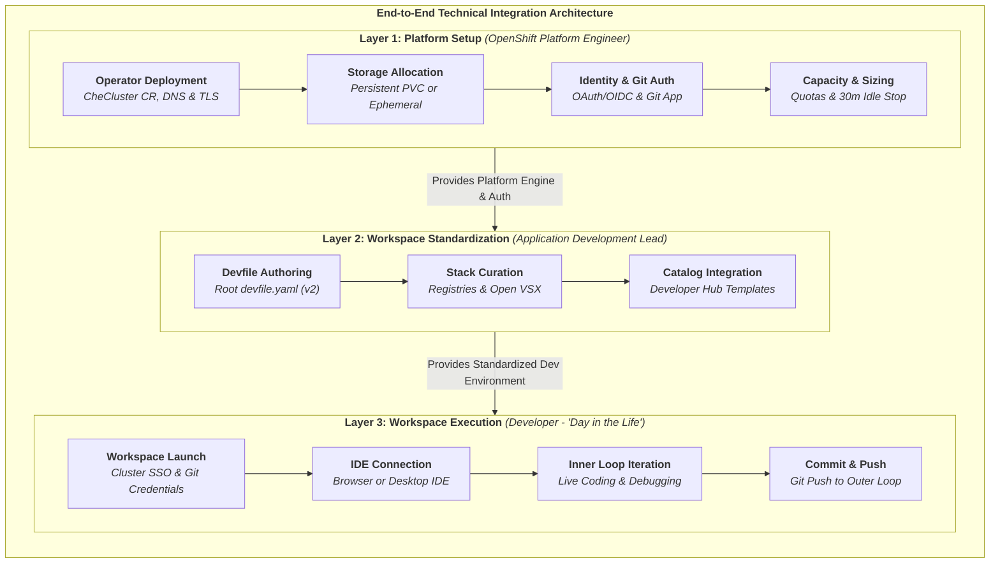
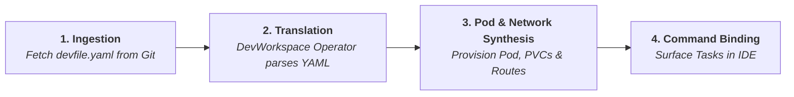

# Adoption Guide - Red Hat OpenShift Dev Spaces

## Table of Contents

* [Bottom Line Up Front (BLUF)](#bottom-line-up-front-bluf)
* [People](#people)
  * [Objective](#objective)
  * [Typical Roles](#typical-roles)
* [Process](#process)
  * [The Inner Loop Shift](#the-inner-loop-shift)
  * [Why Dev Spaces](#why-dev-spaces)
  * [Developer Access Points](#developer-access-points)
* [Technology](#technology)
  * [End-to-End Integration Architecture](#end-to-end-integration-architecture)
  * [Platform Environment Setup](#platform-environment-setup)
  * [Workspace Standardization](#workspace-standardization)
  * [Workspace Execution](#workspace-execution)
* [Appendix A: Prerequisite Knowledge](#appendix-a-prerequisite-knowledge)
* [Appendix B: Reference & Supporting Resources](#appendix-b-reference--supporting-resources)
* [Appendix C: Demystifying devfile.yaml (Anatomy & Execution Mechanics)](#appendix-c-demystifying-devfileyaml-anatomy--execution-mechanics)

---

## Bottom Line Up Front (BLUF)

> ### The Bottom Line
>
> Adoption of Red Hat OpenShift Dev Spaces shifts the interactive coding cycle (the "inner loop") off fragmented local workstations and directly into containerized, repeatable cluster pods on OpenShift.
>
> ---
>
> ### The "Secret Sauce"
>
> A single, version-controlled file sitting in your Git repository—`devfile.yaml`—acts as an automated operational contract between Platform Engineers and Developers. Interpreted by the **DevWorkspace Operator**, it turns multi-day onboarding guides into a **repeatable workspace launch** with language runtimes, build tools, storage, and secure HTTPS routes automatically provisioned.
>
> ---
>
> ### Collaboration is Key
>
> This guide breaks down adoption into **People, Process, and Technology**. Use the **Integration Readiness** checkpoints in each section to clear cross-team dependencies upfront and help improve adoption across teams.

---

## People

### Objective

Adopting OpenShift Dev Spaces requires clear technical handoffs across OpenShift Platform Engineers, Application Development Leads, and Developers. This guide serves as an operational reference to keep teams aligned throughout deployment and daily use.

### Typical Roles

When platform engineers provide stable cluster resources and dev leads curate clean stack specifications, developers can launch, build, and debug without environment friction. Because developer experience is an ongoing practice, developer feedback keeps workspace templates sharp.

* **OpenShift Platform Engineers** manage cluster platform resources
  * Operator management covering configuration, lifecycle updates, and cluster operator health.
  * Storage allocation covering dynamic provisioning and persistent volume management.
  * Access controls covering identity integration, user permissions, and platform security.
* **Application Development Leads** define inner-loop requirements for their teams
  * Tooling requirements covering editors, version control, compilers, and debugging utilities.
  * Runtime and stack requirements covering programming languages, frameworks, dependencies, and test services.
* **Developers** construct, build, and debug software
  * Inner-loop execution covering daily coding, unit testing, and interactive debugging.
  * Workspace feedback covering tool usability, runtime requirements, and developer experience.

### Breaking Down Silos: Cross-Role Integration Points

To prevent adoption friction, teams should establish shared ownership across at least these three roles. Rather than operating in isolated silos, teams interact through multiple integration points:

#### Diagram: Cross-Role Integration Points



---

## Process

### The Inner Loop Shift

Dev Spaces moves the daily inner loop—coding, building, testing, and debugging—off local laptops and directly into containerized cluster pods on OpenShift.

#### Diagram: Modern SDLC



### Why Dev Spaces

In Dev Spaces, a **workspace** is a user-dedicated pod running on OpenShift Container Platform.   The pod is configured with tools such as an IDE (web-based or desktop), language runtimes, build tools, and cloned code.   BecAuse the image(s) in the pod are configured from the devfile.yaml, the users have a uniform environment.

Moving the inner loop off workstations and onto the cluster resolves four major operational headaches:

* **Dev-to-Production Parity:** Eliminates runtime drift by building and testing code inside images matching target OpenShift namespaces.
* **Project-to-Project Isolation:** Prevents runtime collisions on developer laptops when switching between repos with conflicting tool versions (such as Java 11 versus Java 21).
* **Automated Environment Setup:** Replaces multi-page setup guides with version-controlled `devfile.yaml` files that provision tools and runtimes on demand.
* **Workstation Offloading:** Offloads heavy builds, unit tests, and container image generation to cluster nodes.

### Developer Access Points

Dev Spaces acts as the cluster-based inner-loop engine for Red Hat OpenShift:

* **Red Hat Advanced Developer Suite (RHADS):** Developers launch workspaces from Red Hat Developer Hub using pre-configured software templates ("Golden Paths").
* **Ansible Automation Platform (AAP):** Automation engineers launch specialized Ansible workspaces pre-loaded with `ansible-navigator`, execution environments, and VS Code extensions.
* **Direct Git Integration (Standalone):** Developers launch workspaces directly from GitHub, GitLab, or Bitbucket repository URLs or through the OpenShift Web Console.

#### Diagram:  Dev Spaces Entry Points



## Technology

### End-to-End Integration Architecture

Technical execution spans three operational layers: platform setup, workspace standardization, and workspace execution. This map details how platform configuration, tooling specs, and runtime environments layer together:



### Platform Environment Setup

*Action items for OpenShift Platform Engineers:*

| Action Item | Scope & Objective | Integration Readiness Checklist |
| :--- | :--- | :--- |
| **Operator Deployment** | Install Dev Spaces Operator and manage `CheCluster` custom resource | • Active `cluster-admin` RBAC privileges<br>• Access to OperatorHub (or mirrored registry for disconnected setups)<br>• Wildcard DNS (`*.apps.<cluster-domain>`) & TLS on OpenShift Router<br>• Internal Open VSX plugin registry endpoint (if air-gapped) |
| **Dynamic Storage Allocation** | Configure storage classes, volume claims, and retention strategies | • Active dynamic `StorageClass` configured on cluster<br>• Storage strategy selected: **Persistent PVC (RWO)** or **Ephemeral (`emptyDir`)** |
| **Identity & Git Auth** | Integrate SSO and Git SCM provider authentication | • OpenShift OAuth server or external OIDC provider (Keycloak, Azure AD, Okta)<br>• OAuth App registered in Git provider (GitHub, GitLab, Bitbucket, Gitea)<br>• User namespace policy defined (e.g., `devspaces-<username>`) |
| **Capacity & Sizing** | Set CPU/memory limits, namespace quotas, and idle timeouts | • Worker node capacity allocated (~2 vCPU / 4GB RAM per active user pod)<br>• 30–60 min inactivity auto-suspend rule configured in `CheCluster`<br>• `LimitRanges` and `ResourceQuotas` applied to user project templates |

---

### Workspace Standardization

*Action items for Application Development Leads:*

| Action Item | Scope & Objective | Integration Readiness Checklist |
| :--- | :--- | :--- |
| **Devfile Authoring** | Maintain version-controlled `devfile.yaml` (v2) in application repos | • Write/Maintainer permissions on target Git repos<br>• Valid `devfile.yaml` residing in root of application repo |
| **Stack & Tooling Curation** | Define approved base images (UBI), SDKs, tools, and IDE extensions | • Network/pull credentials for container registry (Quay, Artifactory)<br>• Access to public Open VSX plugin registry or internal mirror |
| **Golden Path & Template Curation** | Establish version-controlled reference repos and `devfile.yaml` templates in Git | • Dedicated Git template/starter repositories pre-loaded with root `devfile.yaml`<br>• Out-of-the-box fallback stacks verified (or custom internal Devfile Registry deployed)<br>• *(Optional)* Template cards published to Developer Hub / Backstage catalog |

> **The Secret Sauce: How `devfile.yaml` Works Under the Hood**
>
> * **The Operational Contract:** A `devfile.yaml` acts as an automated contract between the Dev Lead and Platform Team—replacing multi-page workstation setup guides with code.
> * **The Engine Mechanics:** When a developer launches a workspace, the Dev Spaces Operator reads the `devfile.yaml` and dynamically synthesizes an OpenShift pod, attaches persistent storage, configures SDKs, and creates TLS routes in under 90 seconds. *(See **Appendix C** for details).*

---

### Workspace Execution

*Action items for Developers:*

| Action Item | Scope & Objective | Integration Readiness Checklist |
| :--- | :--- | :--- |
| **Workspace Launch** | Start isolated workspace pod from Git URL, Developer Hub, or Console | • Active Single Sign-On (SSO) login credentials<br>• Git PAT or SSH key bound in Dev Spaces user secrets for private repos |
| **IDE Interface Connection** | Connect to workspace via Web Browser or Desktop IDE (VS Code / JetBrains) | • Corporate network/VPN allowing outbound HTTPS/WSS on **Port 443**<br>• Dev Spaces helper extension/CLI installed locally for desktop IDE tunnel |
| **Inner Loop Iteration** | Run live-reloading dev servers, unit tests, and debuggers in cluster pod | • Auto-provisioned user workspace project (`devspaces-<username>`)<br>• Container port exposure declarations defined in `devfile.yaml` |
| **Commit & Push** | Push code changes to Git to trigger outer-loop CI/CD pipelines | • Configured Git identity (email/name) in workspace preferences<br>• Write/push access permissions on target Git feature branches |

---

## Appendix A: Prerequisite Knowledge

To successfully deploy and manage Red Hat OpenShift Dev Spaces, team members should have foundational knowledge in the following areas:

* **OpenShift Platform Engineers:**
  * Basic Kubernetes/OpenShift concepts (Pods, Operators, Custom Resources, Routes, PVCs).
  * Cluster authentication and Identity Provider (IDP) configuration (OAuth/OIDC).
  * StorageClasses and dynamic storage provisioning.
* **Application Development Leads:**
  * Git repository structure and branch management.
  * Container basics (Dockerfile syntax, base images like Red Hat UBI).
  * Familiarity with Devfile v2 syntax and structure.
* **Developers:**
  * Basic Git workflow commands (`commit`, `push`, `pull`).
  * Basic understanding of running development tools within containerized environments.

## Appendix B: Reference & Supporting Resources

### 1. Red Hat OpenShift Dev Spaces

* **Official Product Documentation:** [Red Hat OpenShift Dev Spaces Documentation](https://docs.redhat.com/en/documentation/red_hat_openshift_dev_spaces/3.26) — Complete release notes, installation guides, and administration manuals.
* **Product Overview & Datasheet:** [Red Hat OpenShift Dev Spaces Overview](https://access.redhat.com/products/red-hat-openshift-dev-spaces/) — Enterprise product summary, features, and platform entitlement details.
* **Security & Hardening:** [Red Hat OpenShift Dev Spaces Security Best Practices](https://developers.redhat.com/articles/2024/02/19/red-hat-openshift-dev-spaces-security-best-practices) — Guidance on project isolation, RBAC policies, and namespace security.

### 2. Ansible Automation Platform (AAP) Workspaces

* **AAP Developer Overview:** [Red Hat Ansible Automation Platform Developer Tools](https://developers.redhat.com/products/ansible) — Details on containerized Ansible Development Workspaces running on Dev Spaces with pre-configured VS Code, `ansible-navigator`, and Molecule.
* **Ecosystem Documentation:** [Ansible Community & Developer Documentation](https://docs.ansible.com/) — Official reference for playbooks, execution environments, and developer ecosystem tooling.

### 3. Devfile Specification & Public Registries

* **Devfile Standard Specification:** [Devfile.io Open Standard](https://b-nova.com/en/home/content/unleash-your-dev-potential-with-devfile-all-secrets-unveiled-at-devfile-io/) — Deep dive into Devfile v2 architecture, schema definitions, and inner-loop vs. outer-loop concepts.
* **Community Devfile Registry (GitHub):** [Devfile Community Registry Repository](https://github.com/devfile/registry) — Source repository containing official community stacks, templates, and base images.
* **Devfile Registry Operator:** [OperatorHub Devfile Registry Operator](https://operatorhub.io/operator/registry-operator) — Operator spec for deploying custom internal devfile index and registry servers on OpenShift.

### 4. Complementary Red Hat Developer Products

* **Red Hat Developer Hub (RHDH):** [Red Hat Developer Hub Product Page](https://www.redhat.com/en/technologies/cloud-computing/developer-hub) — Turnkey internal developer portal (based on Backstage) for publishing software catalog templates and "Golden Paths".
* **RHDH Open Source Repository:** [Red Hat Developer Hub GitHub Repo](https://github.com/redhat-developer/rhdh) — Source repository and plugin documentation for Backstage integrations.

### 5. Hands-On Training, Interactive Labs & Sandboxes

* **Developer Sandbox for OpenShift:** [Hosted IDE & Developer Sandbox](https://developers.redhat.com/developer-sandbox/ide) — Free, zero-install hosted OpenShift environment pre-configured with Dev Spaces to test containerized workspaces directly in a browser.
* **Guided Setup Tutorial:** [How to Access the Developer Sandbox for Red Hat OpenShift](https://developers.redhat.com/articles/2023/03/30/how-access-developer-sandbox-red-hat-openshift) — Step-by-step onboarding guide for running browser-based IDE workloads on OpenShift.

### 6. Video Demonstrations & Media

* **Product Tour & Architecture Overview:** [A tour of OpenShift Dev Spaces](https://www.youtube.com/watch?v=DrdcRoZOO9A) — Walkthrough hosted by Red Hat technical leads explaining how Dev Spaces simplifies developer workflows on OpenShift.

---

## Appendix C: Demystifying `devfile.yaml` (Anatomy & Execution Mechanics)

### 1. Summary of Reality: How the Engine Works

To developers, `devfile.yaml` looks like a standard project configuration file in their Git repo. Under the hood, it is an open-standard schema (**Devfile v2**) that acts as a blueprint for a **Kubernetes Custom Resource**.

When a developer clicks "Launch Workspace", this engine pipeline runs:



1. **Ingestion:** Dev Spaces fetches `devfile.yaml` from the target Git branch. *(If no devfile exists, Dev Spaces injects a default Universal Developer Image / UBI devfile).*
2. **Translation:** The **DevWorkspace Operator** parses the YAML and converts it into a native Kubernetes Custom Resource called a `DevWorkspace`.
3. **Pod & Network Synthesis:** The operator reconciles the `DevWorkspace` resource into a single OpenShift Pod:
   * **`components`** become container specifications inside the workspace pod (or sidecars for IDE tools).
   * **`endpoints`** convert automatically into TLS-secured OpenShift Routes on Port 443.
   * **`volumes`** attach Persistent Volume Claims (PVCs) mounted at designated paths (like `/projects` or build caches).
4. **Command Binding:** Declared **`commands`** (build, run, test) surface inside the IDE interface as one-click tasks or terminal shortcuts.

---

### 2. Sample Blueprint: Annotated `devfile.yaml` (v2.2)

Here is a typical enterprise inner-loop `devfile.yaml` for a Java / Quarkus or Node.js microservice:

```yaml
schemaVersion: 2.2.0
metadata:
  name: payment-service-dev
  displayName: Payment Service Inner-Loop Environment
  description: Standardized OpenShift Dev Space for Payment Microservices
  version: 1.0.0

# 1. RUNTIME & TOOLING CONTAINERS
components:
  - name: java-quarkus-runtime
    container:
      image: quay.io/devfile/universal-developer-image:ubi8-latest
      memoryLimit: 4Gi
      memoryRequest: 2Gi
      cpuLimit: 2000m
      cpuRequest: 500m
      mountSources: true
      env:
        - name: JAVA_HOME
          value: /usr/lib/jvm/java-21-openjdk
        - name: MAVEN_OPTS
          value: "-Dmaven.repo.local=/projects/.m2/repository"
      # Expose container ports as OpenShift Routes
      endpoints:
        - name: http-8080
          targetPort: 8080
          exposure: public
          protocol: http
        - name: debug-5005
          targetPort: 5005
          exposure: internal
          protocol: tcp

  # Dedicated persistent cache volume so `mvn install` or `npm install` survives pod restarts
  - name: maven-cache
    volume:
      size: 3Gi

# 2. INNER-LOOP COMMANDS (Mapped to IDE Tasks)
commands:
  - id: dev-mode
    exec:
      component: java-quarkus-runtime
      commandLine: "mvn quarkus:dev"
      workingDir: /projects/payment-service
      group:
        kind: run
        isDefault: true

  - id: run-unit-tests
    exec:
      component: java-quarkus-runtime
      commandLine: "mvn test"
      workingDir: /projects/payment-service
      group:
        kind: test

  - id: attach-debugger
    exec:
      component: java-quarkus-runtime
      commandLine: "mvn quarkus:dev -Ddebug=5005"
      workingDir: /projects/payment-service
      group:
        kind: debug

# 3. AUTOMATED ONBOARDING EVENTS
events:
  postStart:
    - dev-mode
```

---

### 3. Key Reference & Documentation Links

* **Official Devfile Standard Specification:** [Devfile.io Schema Documentation](https://devfile.io/docs/2.2.0/devfile-schema) — Detailed JSON schema definitions for all Devfile v2 properties (`components`, `commands`, `events`, `projects`).
* **Under the Hood - DevWorkspace Operator GitHub:** [devfile/devworkspace-operator Repository](https://github.com/devfile/devworkspace-operator) — The upstream Kubernetes Operator source code that reads devfiles and translates them into OpenShift pods and routes.
* **Red Hat User Guide - Developing with Devfiles:** [Red Hat OpenShift Dev Spaces User Guide: Devfiles](https://docs.redhat.com/en/documentation/red_hat_openshift_dev_spaces/3.26/html/user_guide/introduction-to-devfile) — Official Red Hat documentation on configuring devfiles for OpenShift workspaces.
* **Devfile Community Registry:** [Devfile Community Stacks on GitHub](https://github.com/devfile/registry) — A public collection of pre-made devfile templates for Java, Python, Node.js, Go, .NET, and Rust.
